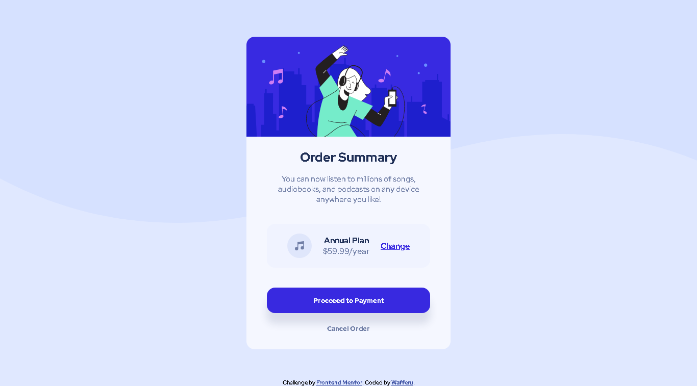

# Frontend Mentor - Order summary card solution

This is a solution to the [Order summary card challenge on Frontend Mentor](https://www.frontendmentor.io/challenges/order-summary-component-QlPmajDUj). Frontend Mentor challenges help you improve your coding skills by building realistic projects.

## Table of contents

- [Overview](#overview)
  - [The challenge](#the-challenge)
  - [Screenshot](#screenshot)
  - [Links](#links)
- [My process](#my-process)
  - [Built with](#built-with)
  - [What I learned](#what-i-learned)
  - [Continued development](#continued-development)
  - [Useful resources](#useful-resources)
- [Author](#author)
- [Acknowledgments](#acknowledgments)

## Overview

### The challenge

The challenge is to build out this order summary card component and get it looking as close to the design as possible.

Users should be able to:

- See hover states for interactive elements

### Screenshot

### Links

- Solution URL: [My Solution](https://www.frontendmentor.io/solutions/order-summary-card-by-wafferu-7cFk1Ije2Z)
- Live Site URL: [Live Site](https://musical-manatee-450566.netlify.app)

## My process

First, I structure the HTML. Then, I styles the webpage in Mobile-first workflow. After that, I work on the responsiveness of the webpage.

### Built with

- Semantic HTML5 markup
- CSS custom properties
- Flexbox
- Mobile-first workflow

### What I learned

I learned on how to style the webpage in Mobile-first workflow.

### Continued development

I will try to focus on how I can style the webpage a lot more faster. I notice that it takes a lot of time while I'm working with this project.

### Useful resources

N/A

## Author

- Frontend Mentor - [@wafferu](https://www.frontendmentor.io/profile/wafferu)

## Acknowledgments

N/A
